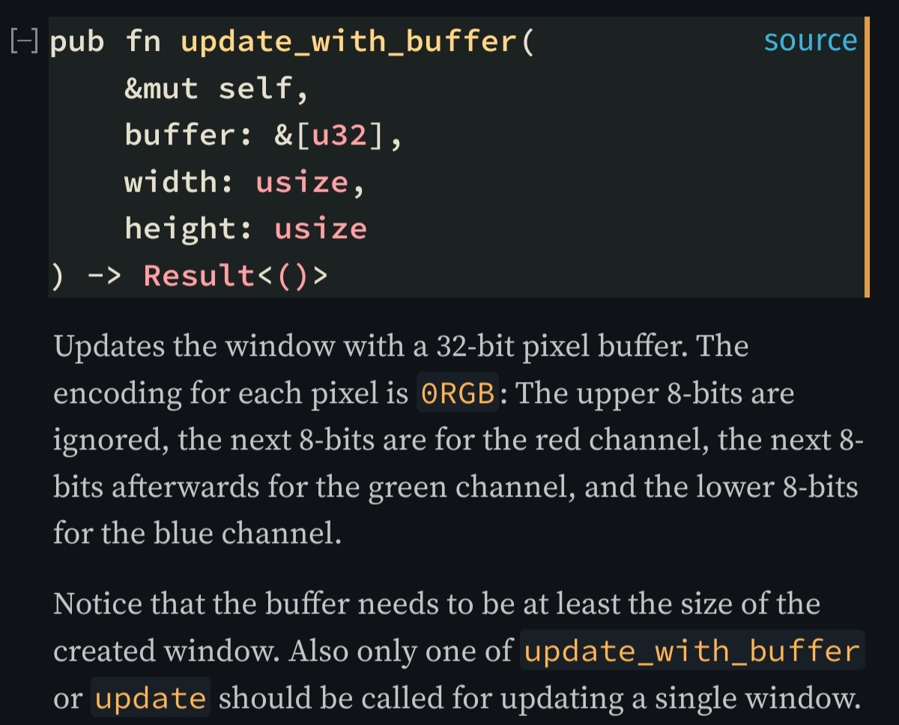
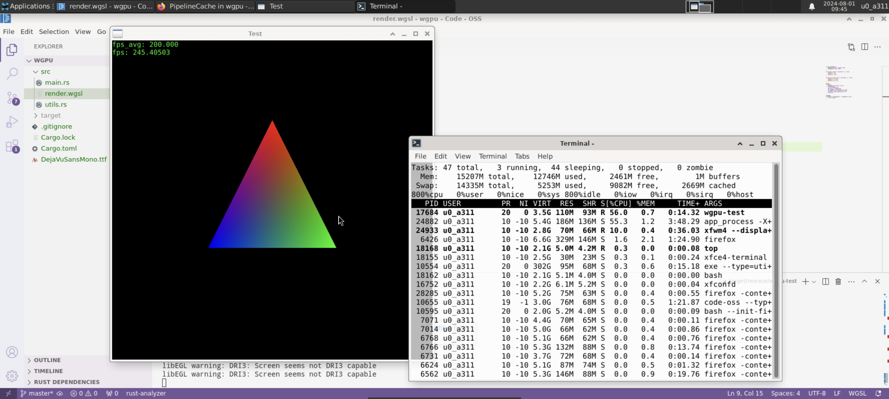

### 如何在termux-x11中用wgpu渲染到窗口
#### 前言
为什么要这么做？ 
现代手机的CPU和GPU性能已经达到相当客观的程度，2023年的旗舰SD8GEN3在CPU上已经相当于i5-10400，GPU相当于AMD680M（来源：极客湾）。所以我打算尝试使用手机加上蓝牙键鼠和便携显示屏替代笔记本电脑，并探究如何在Android中实现游戏开发。  
Termux是一个在Android系统中通过命令行运行bionic linux程序的App，有丰富的包（包括各种语言的编译器和解释器）和原生无损的运行效率。同时，通过termux-x11还可以运行包括电脑端firefox，code-oss(tur)的图形程序，以及xfce，kde等桌面环境。  
除了专门为安卓编译的原生包，termux还可以通过proot（无需手机root）或者chroot（需要手机root）运行完整的linux发行版，如archlinux或debian。  
但是由于proot会造成性能损失（在proot中打开vscode要远慢于在termux中打开原生code-oss），同时现在国内手机的root越来越困难，chroot难以实现，我打算选择直接使用Termux环境而不使用proot。 
在termux中调用GPU（vulkan）大致有两种方法：1. 使用Android自带的驱动；2. 使用mesa-freedreno开源驱动（只对骁龙有用）。可惜的是，这两个对于我的机器（SD8GEN3）均无法直接使用。Termux自带的mesa-freedreno驱动并没有更新到支持SD8GEN3的版本，而使用厂商自带的Android驱动并不支持x11。对于我来说，编译最新版的mesa是一个不大了解的领域，所以我打算对我自己的wgpu程序进行一定的魔改，使之可以在不支持x11的驱动上运行。 
#### 正片
事实上，在不把渲染内容通过dri绘制到窗口上，单纯用wgpu的话，使用安卓自带的vulkan驱动（vulkan-loader-android包）是完全OK的。而这样我们就无法看到渲染的内容。幸好，Rust存在一个库（minifb）可以让我们直接将内存中图像绘制到x窗口中，这样，通过把wgpu渲染的图像复制到内存中，然后交给minifb绘制到窗口中就行了，不过这样的操作会导致多次拷贝而导致性能损失。

minifb中Window的update_buffer方法可以将内存中的图片绘制到窗口中
 

但是，如果我们直接使用这个库的话，会发现在termux环境中并不能成功编译。原因是termux自带的rust编译器默认为安卓环境，而minifb中所有x11相关功能只有在非安卓Linux环境才会编译。于是，我下载了minifb的最新版源码，利用code-oss的的错误检测，直接在所有存在错误的文件中把与Linux相关的编译检测注释掉，这样就可以正常使用了。

参考[learn wgpu中离屏绘制的文章](https://sotrh.github.io/learn-wgpu/showcase/windowless/)，把GPU的输出Texture复制到一个可以MAP_READ的Buffer中，并在读取Buffer将数据直接交给minifb。经测试，输出Texture使用bgra格式可以对应minifb所需的格式。

最终，我对使用这一方法的性能进行了一些测试，640x640的分辨率绘制三角形有约200帧每秒，从top中可以看到，运行时termux-x11（第二个进程）本身也会造成瓶颈。

